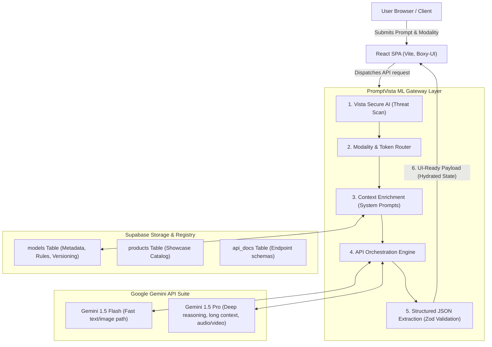
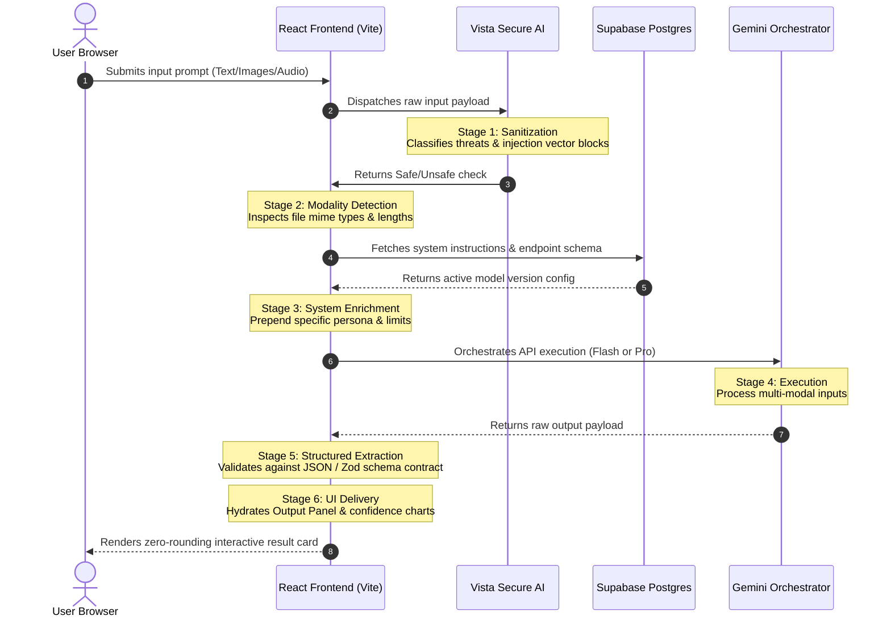
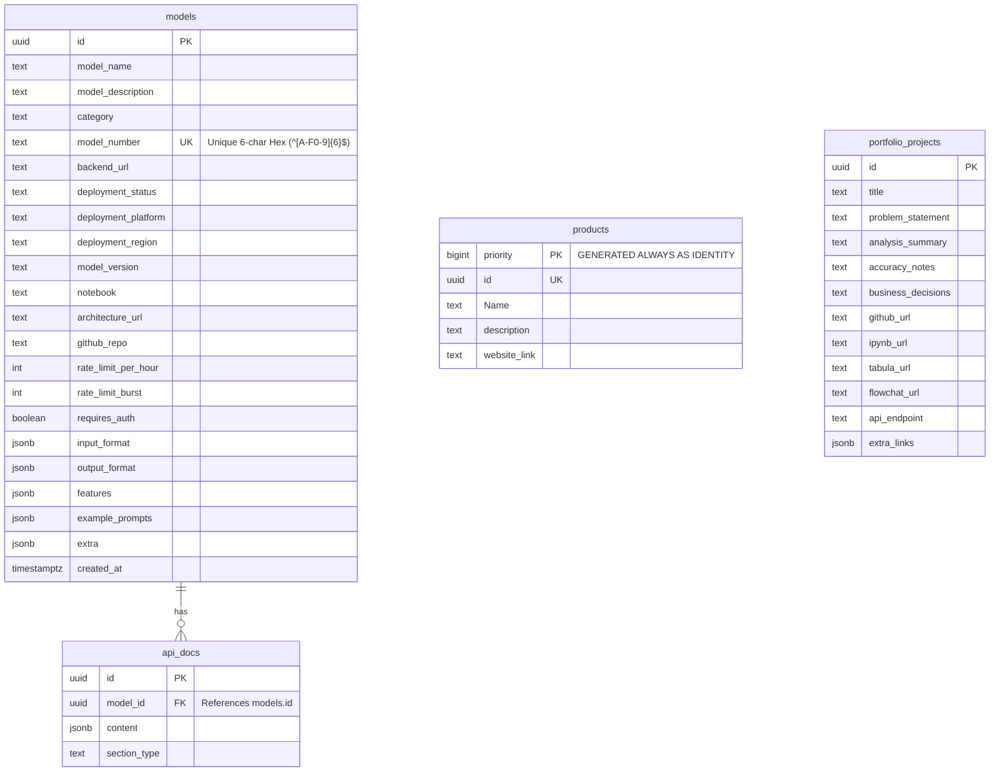

# 🌌 PromptVistaML

[](https://vercel.com)
[](https://supabase.com)
[](https://deepmind.google/technologies/gemini/)
[](https://github.com/dronabopche/100-React-Projects)

> **Stop Filling Forms. Start Prompting ML.**
> A production-grade model playground, prompt-engineering gateway, and programmatic integration platform. Built with a high-contrast, zero-rounding **Antigravity (Boxy-UI)** developer aesthetic, powered by Google's multi-modal Gemini API, and synchronized dynamically via Supabase.

---

## 📖 Table of Contents
- [Platform Overview](#-platform-overview)
- [System Architecture](#%EF%B8%8F-system-architecture)
- [6-Stage Execution Pipeline](#-6-stage-request-processing-pipeline)
- [Database Registry & Schema](#-database-registry--schema-specifications)
- [Featured Product Suite](#-featured-product-suite)
- [Antigravity Design System](#-antigravity-design-system-boxy-ui)
- [Tech Stack](#-technical-stack)
- [Getting Started](#-getting-started)
- [API Integration Examples](#-api-integration-examples)

---

## ⚡ Platform Overview

**PromptVistaML** is an advanced machine learning dashboard and gateway designed for prompt engineers and software architects. Instead of dealing with boilerplate form fields or brittle client-side integrations, developers can evaluate, test, and query live-deployed machine learning models through a single, unified pipeline.

### Core Features:
- **Pre-Flight Prompt Validation**: Powered by Gemini 1.5, checking prompt sufficiency, logical structure, and safety parameters before hitting expensive model endpoints.
- **Dynamic Model Catalog**: Fully paginated, searchable, and category-filtered directory synced dynamically from a managed Supabase database.
- **Interactive Multi-Modal Console**: Real-time evaluation of text, vision, and audio inputs with detailed telemetry (latency, confidence scores, schema compliance).
- **Universal API Gateway**: Exposes secure, consistent curl endpoints for direct integration into third-party codebases.

---

## 🏗️ System Architecture

PromptVistaML divides responsibilities into a decoupled, three-tier architecture: an **Antigravity Frontend** (React SPA), an **Edge Orchestration Gateway** (Deno Deploy & Gemini), and a **Postgres Registry** (Supabase Database & PostgREST API).



---

## 🔄 6-Stage Request Processing Pipeline

Every request is passed through a deterministic pipeline that filters, enriches, executes, and validates inputs to guarantee clean, schema-compliant JSON payloads.



---

## 🗄️ Database Registry & Schema Specifications

Our database utilizes a modern **UUID-First**, **JSON-Native** schema architecture optimized for lightning-fast lookups and loose table coupling.



### Table Definitions

#### 1. `models`
Central registry of all deployed ML and AI models.
*   `id` (UUID): Primary key, auto-generated using `gen_random_uuid()`.
*   `model_number` (text): Unique six-character uppercase hexadecimal string matching regex `^[A-F0-9]{6}$`. Used for SEO-friendly routing.
*   `input_format` / `output_format` (JSONB): Dynamic API contracts. Prevents hardcoded interfaces.
*   `example_prompts` (JSONB): Structured seed data used to populate interactive consoles.

#### 2. `products`
The showcased product catalog.
*   `priority` (bigint): Sequential primary key, generated always as identity (`GENERATED ALWAYS AS IDENTITY`). Lower priorities appear first.
*   `website_link` (text): Embedded iframe target for instant live interactive previews.

---

## 📦 Featured Product Suite

Beyond the core model playground, PromptVistaML serves as the control hub for three enterprise product offerings:

| Product | Focus Area | Key Capability |
| :--- | :--- | :--- |
| **🛡️ VistaSecure AI** | Security & Safety | Real-time prompt-injection classification, JWT-based tenant isolation, and automated IP rate-limiting. |
| **🧠 PromptHallucination ML** | LLM Reliability | Multi-layered logic analysis, embedding drift detection, and factual verification dashboard. |
| **👥 VistaMe HR** | Enterprise Integrations | AI-assisted personnel evaluation, compliance auditing, and secure resume matching. |

---

## 🎨 Antigravity Design System (Boxy-UI)

The UI/UX follows strict **Boxy-UI** aesthetic criteria specified in `src/index.css` to deliver a premium, terminal-grade visual design.

-   **Zero Rounding**: Absolutely no `border-radius`. All buttons, panels, inputs, and cards use sharp 90-degree corners (`border-radius: 0 !important`).
-   **High-Contrast Borders**: Sharp 1px or 2px solid dividers (`border-gray-200` in light mode, `border-gray-800` or `brand-purple` in dark mode).
-   **Monochromatic Foundations**: Layouts favor pure whites, deep grays, and `brand-black` (`#0b0b0f`).
-   **Vibrant Accents**:
    *   `Brand Purple` (`#6d28d9`): Highlighting code snippets, active routes, and execution triggers.
    *   `Brand Yellow` (`#facc15`): Status tickers, warnings, and secondary call-to-actions.
-   **Blueprint Textures**: Uses `.pv-grid` CSS backgrounds (40px square layouts) and custom `.pv-glow` ambient lighting maps to provide visual depth without layout shift.

---

## 🛠️ Technical Stack

-   **Frontend**: React 18 (Concurrent Mode rendering), Vite 5 (Bundler + ESBuild compilation), Tailwind CSS v3 (JIT layout framework), React Router v6 (Nested layout management).
-   **Backend & DB**: Supabase (PostgreSQL 15 engine, Row-Level Security policies, Realtime WebSockets, PostgREST direct schemas).
-   **Orchestration API**: Deno Edge Runtime, Google Gemini 1.5 API family (Flash & Pro variants).
-   **Data Parsing**: PapaParse (CSV parser), XLSX (Excel spreadsheet ingestion), React Markdown (Dynamic code and document renderer).

---

## 🚀 Getting Started

### Prerequisites
- Node.js (v18 or higher)
- npm or pnpm

### Installation

1.  **Clone the Repository**:
    ```bash
    git clone https://github.com/dronabopche/100-React-Projects.git
    cd 01_PromptVistaML
    ```

2.  **Install Dependencies**:
    ```bash
    npm install
    ```

3.  **Configure Environment Variables**:
    Create a `.env` file in the root directory:
    ```env
    VITE_SUPABASE_URL=https://your-project-id.supabase.co
    VITE_SUPABASE_ANON_KEY=eyJhbGciOiJIUzI1NiIsInR5cCI6IkpXVCJ9...
    ```

4.  **Launch Local Development Server**:
    ```bash
    npm run dev
    ```
    The application will compile and open at `http://localhost:5173`.

---

## 💻 API Integration Examples

Query models programmatically through our gateway using standard integrations.

### 1. cURL Request
```bash
curl -X POST https://api.vista.ml/verify \
  -H "Authorization: Bearer $VISTA_API_KEY" \
  -H "Content-Type: application/json" \
  -d '{
    "text": "Identify the primary programming languages in React Native.",
    "model": "gemini-1.5-flash",
    "threshold": 0.95
  }'
```

### 2. Node.js Integration
```javascript
const queryModel = async () => {
  const response = await fetch('https://api.vista.ml/verify', {
    method: 'POST',
    headers: {
      'Authorization': `Bearer ${process.env.VISTA_API_KEY}`,
      'Content-Type': 'application/json'
    },
    body: JSON.stringify({
      text: "Analyze sentiment of: This framework has completely resolved our deployment overhead.",
      model: "gemini-1.5-pro"
    })
  });
  
  const result = await response.json();
  console.log(`Model Response:`, result);
};
```
