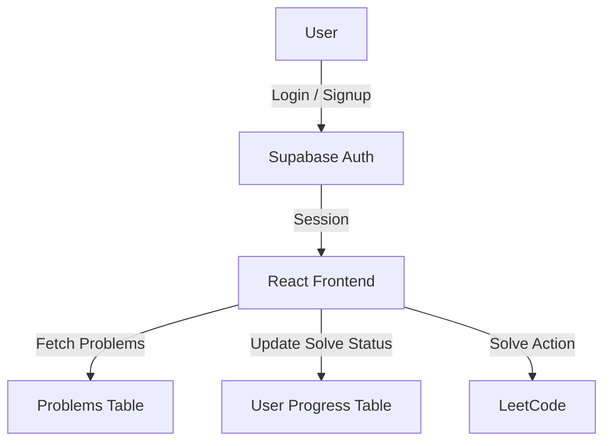
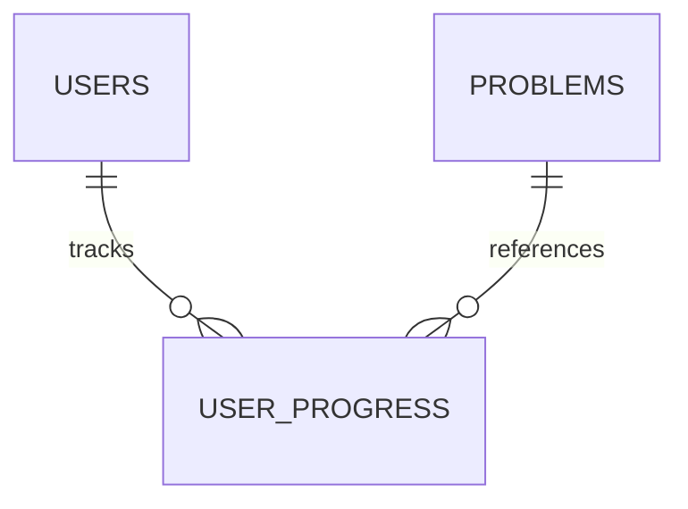

# LNT Tracker

<p align="center">
  
</p>

<p align="center">
  &nbsp;&nbsp;
  &nbsp;&nbsp;
  &nbsp;&nbsp;
  &nbsp;&nbsp;
  &nbsp;&nbsp;
  
</p>

<p align="center">
  <b>React · Vite · HTML · CSS · Tailwind · Supabase</b>
</p>

---

LNT Tracker is a **web-based LeetCode progress tracking platform** designed to help users systematically work through a curated DSA problem set. The platform tracks solved problems, visualizes progress, and provides structured problem sheets with a workflow inspired by version control.

---

## 📄 Overview

LNT Tracker enables users to:

* Track progress across **225 curated LeetCode problems**
* Work through **structured problem sheets (seats)**
* Visualize progress using **dashboards and progress bars**
* Authenticate securely using **Supabase**
* Redirect directly to **LeetCode** for problem solving
* Maintain **persistent progress across sessions**

---

## 🛠 Technology Stack

### Frontend

* React
* Vite
* HTML5
* CSS3
* Tailwind CSS

### Backend

* Supabase

  * Authentication
  * PostgreSQL database
  * Row-Level Security (RLS)

---

## 📐 System Architecture

The application follows a **frontend-driven architecture**, with Supabase acting as both the authentication provider and backend database.

### Application Flow Diagram



---

## 🗄 Database Design

The backend consists of two primary tables managed within Supabase.

### Database Relationship Diagram



---

## 📋 Database Tables

### 1. User Progress Table

**Table Name:** `user_progress`

| Column Name | Type       | Description                    |
| ----------- | ---------- | ------------------------------ |
| id          | uuid       | Primary key                    |
| user_id     | uuid       | Supabase authenticated user ID |
| problem_id  | int / text | Reference to problem           |
| solved_at   | timestamp  | Time of completion             |
| created_at  | timestamp  | Record creation time           |

**Purpose:**

* Used to calculate solved count
* Drives progress bars and dashboard metrics
* Maintains user-specific problem state

---

### 2. Problems Table (Sheet One)

**Table Name:** `sheet_one`

| Column Name  | Type      | Description            |
| ------------ | --------- | ---------------------- |
| id           | int       | Primary key            |
| title        | text      | Problem title          |
| leetcode_url | text      | External LeetCode link |
| category     | text      | DSA category           |
| difficulty   | text      | Easy / Medium / Hard   |
| created_at   | timestamp | Record creation time   |

**Purpose:**

* Acts as the source of truth for the seat
* Enables future expansion with additional sheets
<p align="center">
  
</p>

---

## 📊 Application Features

### Seat Page

* Displays **225 problems**
* Organized into **15 categories**
* Difficulty tags for each problem
* Solve action redirects to LeetCode
* Solved problems are visually marked

### Dashboard

* Total problems solved
* Overall completion percentage
* Progress bar visualization

### Theme Toggle

* Light and dark themes
* Implemented using Tailwind CSS utilities
* Preference persisted locally

---

## 📁 Project Structure

```
LNT-Tracker/
│
├── public/
│   └── icon.svg
├── index.html
├── package.json
├── vite.config.js
│
├── src/
│   ├── LNT-Tracker/
│   │   ├── App.jsx
│   │   ├── Dashboard.jsx
│   │   ├── SeatPage.jsx
│   │   ├── Max.jsx
│   │   ├── Min.jsx
│   │   ├── index.css
│   │
│   ├── main.jsx
│
└── README.md
```

---

## 🔐 Authentication

* Supabase email/password authentication
* Secure session handling
* User-specific progress isolation via RLS policies

---

## 🔄 Extensibility

Planned additions include:

* Multiple selectable problem sheets
* Additional problem categories
* Enhanced analytics per sheet
* Improved dashboard metrics

---

## ⚙️ Local Setup

```bash
git clone https://github.com/your-username/lnt-tracker.git
cd lnt-tracker
npm install
npm run dev
```

---

## 📜 License

Open Service License

---

## 👤 Author

**StudyGroupTeamDSA**


