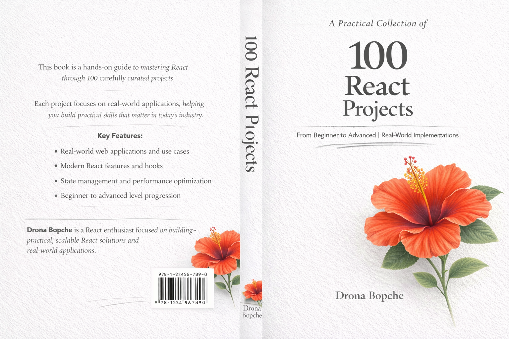

# 100-React-Projects

    

## Projects List

| No. | Project Name      | Live Link                                                                |
| --- | ----------------- | ------------------------------------------------------------------------ |
| 01  | Prompt Vista ML   | [https://promptvistaml.vercel.app](https://promptvistaml.vercel.app)     |
| 02  | Data Science Show | [https://datascienceshow.vercel.app](https://datascienceshow.vercel.app) |
| 03  | LnT Tracker       | [https://lnt-tracker.vercel.app](https://lnt-tracker.vercel.app)         |
| 04  | Portfolio Website | -                                                                        |
| 05  | MathBit           | -                                                                        |
| 06  | PixelAttend       | [https://pixelattend.vercel.app](https://pixelforge.vercel.app)          |
| 07  | ATSanlyzer        | [https://atsanlyzer.vercel.app](https://uihaven.vercel.app)              |
| 08  | GymCanvas         | [https://codecanvas.vercel.app](https://codecanvas.vercel.app)           |
| 09  | DevNest           | [https://devnest.vercel.app](https://devnest.vercel.app)                 |
| 10  | WebBloom          | [https://webbloom.vercel.app](https://webbloom.vercel.app)               |
| 11  | NeonFrame         | [https://neonframe.vercel.app](https://neonframe.vercel.app)             |
| 12  | GridSpark         | [https://gridspark.vercel.app](https://gridspark.vercel.app)             |
| 13  | FluxUI            | [https://fluxui.vercel.app](https://fluxui.vercel.app)                   |
| 14  | PixelWave         | [https://pixelwave.vercel.app](https://pixelwave.vercel.app)             |
| 15  | NovaBoard         | [https://novaboard.vercel.app](https://novaboard.vercel.app)             |
| 16  | BrightLayer       | [https://brightlayer.vercel.app](https://brightlayer.vercel.app)         |
| 17  | SnapInterface     | [https://snapinterface.vercel.app](https://snapinterface.vercel.app)     |
| 18  | QuickDash         | [https://quickdash.vercel.app](https://quickdash.vercel.app)             |
| 19  | HoverSpace        | [https://hoverspace.vercel.app](https://hoverspace.vercel.app)           |
| 20  | DesignLoop        | [https://designloop.vercel.app](https://designloop.vercel.app)           |
| 21  | WebSprint         | [https://websprint.vercel.app](https://websprint.vercel.app)             |
| 22  | PixelCrafted      | [https://pixelcrafted.vercel.app](https://pixelcrafted.vercel.app)       |
| 23  | CodeHarbor        | [https://codeharbor.vercel.app](https://codeharbor.vercel.app)           |
| 24  | UIOrbit           | [https://uiorbit.vercel.app](https://uiorbit.vercel.app)                 |
| 25  | FrontFlow         | [https://frontflow.vercel.app](https://frontflow.vercel.app)             |
| 26  | DevCanvas         | [https://devcanvas.vercel.app](https://devcanvas.vercel.app)             |
| 27  | NovaPixel         | [https://novapixel.vercel.app](https://novapixel.vercel.app)             |
| 28  | InterfaceLab      | [https://interfacelab.vercel.app](https://interfacelab.vercel.app)       |
| 29  | SkyUI             | [https://skyui.vercel.app](https://skyui.vercel.app)                     |
| 30  | CodeVista         | [https://codevista.vercel.app](https://codevista.vercel.app)             |
| 31  | PixelGrid         | [https://pixelgrid.vercel.app](https://pixelgrid.vercel.app)             |
| 32  | BrightUI          | [https://brightui.vercel.app](https://brightui.vercel.app)               |
| 33  | HoverLab          | [https://hoverlab.vercel.app](https://hoverlab.vercel.app)               |
| 34  | DevOrbit          | [https://devorbit.vercel.app](https://devorbit.vercel.app)               |
| 35  | SparkInterface    | [https://sparkinterface.vercel.app](https://sparkinterface.vercel.app)   |
| 36  | CodeNest          | [https://codenest.vercel.app](https://codenest.vercel.app)               |
| 37  | UIForge           | [https://uiforge.vercel.app](https://uiforge.vercel.app)                 |
| 38  | PixelDash         | [https://pixeldash.vercel.app](https://pixeldash.vercel.app)             |
| 39  | WebScape          | [https://webscape.vercel.app](https://webscape.vercel.app)               |
| 40  | FluxBoard         | [https://fluxboard.vercel.app](https://fluxboard.vercel.app)             |
| 41  | NeonUI            | [https://neonui.vercel.app](https://neonui.vercel.app)                   |
| 42  | DevSpark          | [https://devspark.vercel.app](https://devspark.vercel.app)               |
| 43  | GridCanvas        | [https://gridcanvas.vercel.app](https://gridcanvas.vercel.app)           |
| 44  | PixelLoop         | [https://pixelloop.vercel.app](https://pixelloop.vercel.app)             |
| 45  | NovaInterface     | [https://novainterface.vercel.app](https://novainterface.vercel.app)     |
| 46  | CodeWave          | [https://codewave.vercel.app](https://codewave.vercel.app)               |
| 47  | UIHarbor          | [https://uiharbor.vercel.app](https://uiharbor.vercel.app)               |
| 48  | FrontNest         | [https://frontnest.vercel.app](https://frontnest.vercel.app)             |
| 49  | BrightCanvas      | [https://brightcanvas.vercel.app](https://brightcanvas.vercel.app)       |
| 50  | HoverDash         | [https://hoverdash.vercel.app](https://hoverdash.vercel.app)             |
| 51  | DevFlow           | [https://devflow.vercel.app](https://devflow.vercel.app)                 |
| 52  | PixelOrbit        | [https://pixelorbit.vercel.app](https://pixelorbit.vercel.app)           |
| 53  | CodeSparked       | [https://codesparked.vercel.app](https://codesparked.vercel.app)         |
| 54  | UIFrame           | [https://uiframe.vercel.app](https://uiframe.vercel.app)                 |
| 55  | WebNest           | [https://webnest.vercel.app](https://webnest.vercel.app)                 |
| 56  | NovaDash          | [https://novadash.vercel.app](https://novadash.vercel.app)               |
| 57  | GridForge         | [https://gridforge.vercel.app](https://gridforge.vercel.app)             |
| 58  | PixelScape        | [https://pixelscape.vercel.app](https://pixelscape.vercel.app)           |
| 59  | DevBoard          | [https://devboard.vercel.app](https://devboard.vercel.app)               |
| 60  | CodeOrbit         | [https://codeorbit.vercel.app](https://codeorbit.vercel.app)             |
| 61  | UIWave            | [https://uiwave.vercel.app](https://uiwave.vercel.app)                   |
| 62  | FrontForge        | [https://frontforge.vercel.app](https://frontforge.vercel.app)           |
| 63  | BrightDash        | [https://brightdash.vercel.app](https://brightdash.vercel.app)           |
| 64  | PixelNest         | [https://pixelnest.vercel.app](https://pixelnest.vercel.app)             |
| 65  | DevInterface      | [https://devinterface.vercel.app](https://devinterface.vercel.app)       |
| 66  | WebOrbit          | [https://weborbit.vercel.app](https://weborbit.vercel.app)               |
| 67  | CodeDash          | [https://codedash.vercel.app](https://codedash.vercel.app)               |
| 68  | UIFlow            | [https://uiflow.vercel.app](https://uiflow.vercel.app)                   |
| 69  | PixelFrame        | [https://pixelframe.vercel.app](https://pixelframe.vercel.app)           |
| 70  | GridDash          | [https://griddash.vercel.app](https://griddash.vercel.app)               |
| 71  | DevScape          | [https://devscape.vercel.app](https://devscape.vercel.app)               |
| 72  | CodeForgeX        | [https://codeforgex.vercel.app](https://codeforgex.vercel.app)           |
| 73  | UIBuilder         | [https://uibuilder.vercel.app](https://uibuilder.vercel.app)             |
| 74  | PixelBuilder      | [https://pixelbuilder.vercel.app](https://pixelbuilder.vercel.app)       |
| 75  | NovaFlow          | [https://novaflow.vercel.app](https://novaflow.vercel.app)               |
| 76  | WebDashX          | [https://webdashx.vercel.app](https://webdashx.vercel.app)               |
| 77  | CodeScape         | [https://codescape.vercel.app](https://codescape.vercel.app)             |
| 78  | UIXpress          | [https://uixpress.vercel.app](https://uixpress.vercel.app)               |
| 79  | PixelX            | [https://pixelx.vercel.app](https://pixelx.vercel.app)                   |
| 80  | DevForge          | [https://devforge.vercel.app](https://devforge.vercel.app)               |
| 81  | BrightFlow        | [https://brightflow.vercel.app](https://brightflow.vercel.app)           |
| 82  | CodeNestX         | [https://codenestx.vercel.app](https://codenestx.vercel.app)             |
| 83  | UIOrbitX          | [https://uiorbitx.vercel.app](https://uiorbitx.vercel.app)               |
| 84  | PixelSparkX       | [https://pixelsparkx.vercel.app](https://pixelsparkx.vercel.app)         |
| 85  | WebForgeX         | [https://webforgex.vercel.app](https://webforgex.vercel.app)             |
| 86  | DevDashX          | [https://devdashx.vercel.app](https://devdashx.vercel.app)               |
| 87  | CodeUIX           | [https://codeuix.vercel.app](https://codeuix.vercel.app)                 |
| 88  | PixelNova         | [https://pixelnova.vercel.app](https://pixelnova.vercel.app)             |
| 89  | UIHorizon         | [https://uihorizon.vercel.app](https://uihorizon.vercel.app)             |
| 90  | DevHorizon        | [https://devhorizon.vercel.app](https://devhorizon.vercel.app)           |
| 91  | CodeHorizon       | [https://codehorizon.vercel.app](https://codehorizon.vercel.app)         |
| 92  | PixelHorizon      | [https://pixelhorizon.vercel.app](https://pixelhorizon.vercel.app)       |
| 93  | WebHorizon        | [https://webhorizon.vercel.app](https://webhorizon.vercel.app)           |
| 94  | UIUniverse        | [https://uiuniverse.vercel.app](https://uiuniverse.vercel.app)           |
| 95  | DevUniverse       | [https://devuniverse.vercel.app](https://devuniverse.vercel.app)         |
| 96  | CodeUniverse      | [https://codeuniverse.vercel.app](https://codeuniverse.vercel.app)       |
| 97  | PixelUniverse     | [https://pixeluniverse.vercel.app](https://pixeluniverse.vercel.app)     |
| 98  | WebUniverse       | [https://webuniverse.vercel.app](https://webuniverse.vercel.app)         |
| 99  | UIInfinity        | [https://uiinfinity.vercel.app](https://uiinfinity.vercel.app)           |
| 100 | DevInfinity       | [https://devinfinity.vercel.app](https://devinfinity.vercel.app)         |
